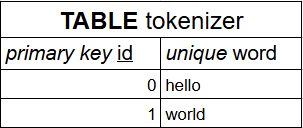
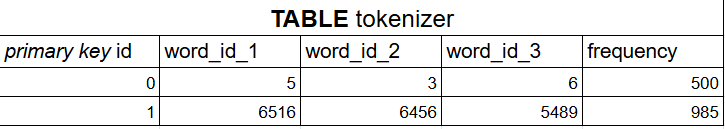

# C IA Builder

CIAB (C IA Builder) est un projet opensource qui a pour but de fournir des fonctions écrites en C pour créer des modèles d'IA qui génère du texte de manière économique et très basique.

# Comment ça marche ?

## Datasets

Les datasets sont un ensemble de donnée utilisé pour entrainer et fournir les connaissances au modèle d'IA

## Préparation du modèle

Le programme "creator" va commencer par lire tous les fichiers et récupérer tous les mots existants uniques dans les datasets fournis, ensuite on va chercher la probabilité qu'un mot X apparaît après 2 mot Y et Z.

## Stockage

Le modèle sera sauvegardé dans des fichiers .bin, pour qu'ils soient le plus simple possible et très "bas niveau".

## Génération

Le programme "generator" va lire les fichiers `.bin` passés en argument et va ouvrir une interface CLI pour que vous fassiez les requêtes au modèle.

## Archives

A chaque fin de version, une release sera publié sur le repository et les détails des changements / mises à jour sont expliqués ci-dessous:

# WIP & Changelog

## Version 1.0

La version 1.0 se base sur un modèle d'IA dit trigramme en utilisant les deux tables ci-dessous :  

Tout cela sauvegardé dans un fichier `.db` en utilisant sqlite.

Lien: https://github.com/Program132/CIAB/releases/tag/V1.0

## Version 1.5 (En cours)

La version 1.5 restera sur la même base que la 1.0, seulement on utilisera plus une base de donnée sqlite 
mais simplement un fichier binaire (ou plusieurs) pour stocker notamment les trigrammes, pour accélérer les calculs
et les recherches, plutôt que dans une base de donnée classique, on écrira en binaire, dans un `.bin`

Vitesse preprocessor.py (`.bin`): `Indexation des fichiers: 2562621 fichiers [00:15, 165557.39 fichiers/s]` 
Vitesse tokenizer.py (`.bin`):`Tokenisation:   13:22<00:00, 2811.60 fichiers/s, vocab_size=5165642`

## Version 1.75 (En attente)

La version 1.75 reprend la 1.5 mais en C.

## Version 2.0 (En attente)

La version 2.0 rajoutera à la 1.5 les embeddings : on créer des vecteurs pour "montrer" au modèle
que deux phrases peuvent être proches par exemple "un chat dort sur le fauteuil" et "un chien dort sur le fauteuil".
Et pour compléter la requête par exemple, on appliquera un produit scalaire entre deux vecteurs pour savoir les plus intéressants et ainsi trouver une bonne suite à la phrase.